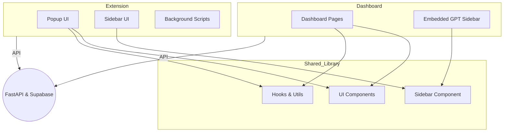

# Architectural Plan: Integrate GPT Sidebar Prototype Design into Dashboard and Extension

---

### **Prototype Design Highlights**

- **Rich Tailwind CSS styling** for modern, responsive UI
- **Reusable React components** for sidebar, chat, UI controls (`src/components/ui/`)
- **Sidebar component** (`src/components/Sidebar.tsx`) with modular CSS
- **Next.js structure** with app routes and layouts
- **Chrome extension implementation** with popup, sidebar, background scripts
- **Icons and assets** for consistent branding
- **Hooks and utils** for state management and API calls

---

### **Integration Strategy**

### **1. Shared Component Library**

- Extract `src/components/ui/` and `src/components/Sidebar.tsx`
- Place into a **monorepo shared library**, e.g., `/shared/components/`
- Standardize Tailwind config across projects

---

### **2. Dashboard App**

- Replace current sidebar with **prototype Sidebar component**
- Use shared UI components for forms, dialogs, buttons, chat interface
- Style dashboard with Tailwind for consistent look and feel
- Connect sidebar to FastAPI backend & Supabase for chat, onboarding, membership

---

### **3. Chrome Extension**

- Refactor existing sidebar-extension to use **shared Sidebar component**
- Use shared UI components for popup and sidebar
- Maintain extension-specific scripts (background, content)
- Style with Tailwind and prototype assets

---

### **4. Backend Integration**

- Connect sidebar chat to GPT backend via APIs
- Use onboarding and membership endpoints for user flow
- Store data in Supabase

---

### **5. Developer Workflow**

- Use **monorepo** with:
    - `/dashboard` (React app)
    - `/extension` (Chrome extension)
    - `/shared` (components, styles, hooks)
- Enables **code reuse** and **easy updates**

---

### **Mermaid Diagram**

---

### **Summary**

- Leverage the **prototype's rich UI design** across all platforms.
- Create a **shared component library** for maintainability.
- Integrate into dashboard and extension for a **cohesive user experience**.
- Connect all to the backend for full functionality.

This plan will modernize your UI, streamline development, and unify your platform's look and feel.