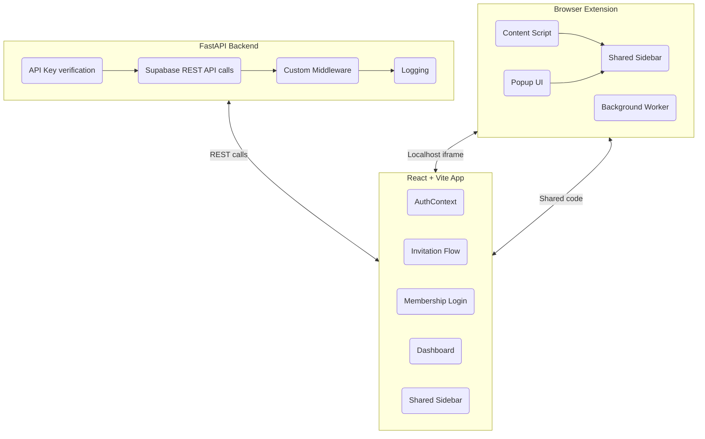

# SpaceWH AI Platform — Comprehensive Review & Improvement Plan

---

## **1. Overview**

This document summarizes a full review and diagnosis of the SpaceWH AI Platform, including backend API, frontend React app, browser extension, and shared components. It identifies strengths, issues, and proposes prioritized improvements.

---

## **2. High-Level Architecture

---

## **3. Backend Diagnosis**

### Strengths:
- Async FastAPI app with clear admin/user separation
- Custom middleware (rate limiting, timing, security headers)
- Structured JSON logging
- API key protection for admin endpoints
- Invitation → onboarding → membership flow clearly defined

### Issues:
- **Dual DB schemas:** SQLAlchemy models created but **unused**; Supabase REST API is the real datastore
- **No Pydantic models** or request validation
- **Minimal error handling** on Supabase calls; failures may cause 500 errors
- **Secrets:** no validation for presence of ADMIN_API_KEY
- **No automated tests**

---

## **4. Frontend Diagnosis**

### Strengths:
- Modular React components with context
- Auth flow enforced via redirects
- Tailwind CSS styling
- QR code onboarding
- Shared UI components across app and extension

### Issues:
- **Hardcoded backend URLs** (e.g., `http://localhost:3000`)
- **Inconsistent context usage**; mutation of context not aligned with exported API
- **No input validation or debouncing**
- **No 404 or error boundaries**
- **Minimal user feedback on errors**

---

## **5. Browser Extension Diagnosis**

### Strengths:
- MV3 manifest, modular background and content scripts
- Injects sidebar via iframe, reuses frontend UI
- Passes auth/events via message passing
- Shared components reused

### Issues:
- **Relies heavily on localhost servers** (dev mode only)
- **Minimal error handling**
- **No production API endpoints configured**

---

## **6. Shared Components Diagnosis**

### Strengths:
- Shared Sidebar adapts to extension or app environment
- Auth context integration
- Modular UI elements

### Issues:
- **Unconventional dynamic imports with hooks** may cause bugs
- **Hardcoded chat API URL**
- **Admin button unimplemented**

---

## **7. Prioritized Improvement Plan**

### Backend:
- Remove unused SQLAlchemy code or migrate fully to ORM
- Add Pydantic request/response schemas
- Wrap Supabase calls with try/except and detailed error responses
- Validate all critical secrets
- Add API tests with pytest + httpx
- Harden production configs

### Frontend:
- Refactor AuthContext for consistent API
- Externalize API URLs via env vars
- Add input validation, debouncing
- Add 404 route and error boundaries
- Improve user feedback on errors
- Add frontend tests

### Extension:
- Prepare production build with hosted frontend
- Harden permissions
- Add error handling
- Implement admin feature or hide button

### Shared:
- Refactor Sidebar to avoid dynamic hook calls
- Externalize API URLs
- Implement admin panel or remove placeholder
- Add tests

### Cross-cutting:
- Centralize configs
- Document setup & deployment
- Automate lint/test/build in CI/CD

---

## **8. Summary**

The platform has a solid modular foundation with clear flows, but would benefit from validation, error handling, configuration management, and production readiness improvements. The above plan provides a clear path to a more robust and maintainable system.